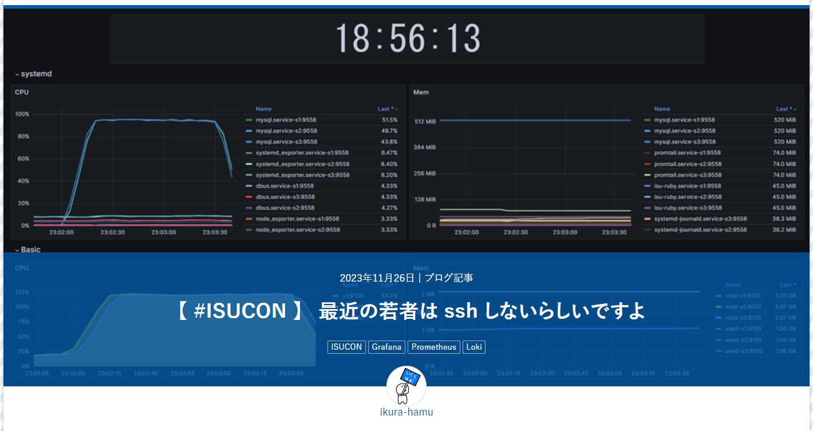
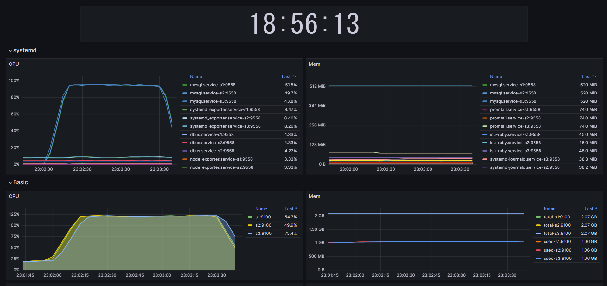

<!--
_class: title
_paginate: false
_footer: " "
-->

# 最近の若者はsshしない(する) らしいですよ

## @ikura-hamu / traP ISUCON LT

---

# 自己紹介

## いくら・はむ (@ikura-hamu)

東京工業大学　学士2年

Go （サーバーサイド）

ISUCON13は「リアクティブ二子玉川～♪」として初めて出場しました。

<!--
東京工業大学学士2年のいくら・はむです。traPでは、主にGoでサーバーのアプリケーションを書いています。今年のISUCON13では、「リアクティブ二子玉川～♪」というチームで初めて出場しました。今日はよろしくお願いします。
-->

---

# 今日話す内容

## ISUCON用ツール群 「isu-isu-h」

<a href="https://trap.jp/post/2047/">https://trap.jp/post/2047/</a>

<!--
今日話す内容は、今年のISUCONに向けて作ったツール群、「isu-isu-h」です。これに関する記事を書いたところ、はてなブログのブックマーク数がかなり多くなり、177件ということで、かなりタイトル詐欺感のある記事なのですが、読んでいただいた方もいるかもしれません。
今日はこの「isu-isu-h」というツール群について、作ったときの思考を紹介しようと思います。
-->

---

<!--
_class: lead
-->

# ISUCON で、何してますか？

<!--
今回の話は、みなさんは、ISUCONで何してますか？、というところから始まります。

みなさん、ISUCONで、何してますか？
-->

---

# ISUCON で、何してますか？

- **高速化のために改善**
  - それはそう
  - 本質
- **改善以外は？**
  - ツール導入
  - 計測
  - デプロイ
  - などなど…

<!--
まあ、高速化のためにいろんな改善を入れていると思います。これがISUCONという競技の本質で、速い人が勝ちなので、当然です。

ですが、高速化のために手を動かす以外にも、計測ツールを入れて、計測して、改善したアプリをデプロイして、と改善する作業そのもの以外にも、さまざまなことを競技の8時間の間にしていると思います。

ですが、ですが、
-->

---

# ISUCON で、何してますか？

- **高速化のために改善**
  - それはそう
  - 本質
- **改善以外は？**
  - ツール導入
  - 計測
  - デプロイ
  - などなど…

**    👈ここ、もったいなくないですか？**

<!--
ここ、もったいなくないですか？
時間がたっぷりあればいろいろやってもいいのですが、改善にたくさん時間を使いたいですよね。
-->

---

# isu-isu-h 出現前の作業

<!--
_class: small
-->

|     | 場所                          | やること                                                  |
| --- | ----------------------------- | --------------------------------------------------------- |
| 1   | 手元のターミナル              | commit、push                                              |
| 2   | 問題サーバー                  | 各サーバーに ssh して pull、設定ファイルの反映 (Makefile) |
| 3   | 問題サーバー                  | いろいろビルド、再起動                                    |
| 4   | ブラウザ                      | ベンチマーク回す                                          |
| 5   | 問題サーバー                  | プロファイラ(pprof)を動かす                               |
| 6   | 問題サーバー                  | CPUなどのメトリクスを眺める                               |
| 7   | 問題サーバー                  | スローログ、アクセスログをまとめて Discord に送る         |
| 8   | ブラウザ                      | pprof の結果を見る                                        |
| 9   | ブラウザ、Discord、エディタ … | 計測結果を踏まえて改善する                                |

<!--
こちらは、僕がisu-isu-hを作る前の作業の流れです。
まず、手元で作業した結果をコミットして、GitHubにpushします。
次に、問題サーバーにsshして、GitHubからpullして、ミドルウェアの設定ファイルをリポジトリに含めているのでそれを反映して、アプリをビルドして、ミドルウェアとアプリを再起動します。
そのあとベンチマークを回します。本番ならブラウザのポータルからやりますし、練習ではベンチマークサーバーにsshで入ってコマンドを打ちます。
ベンチマークが回り始めたらプロファイラ、僕はGoを使うのでpprofのコマンドを問題サーバーで打ちます。
ベンチが回ってる間はhtopとかdstatとかを見てCPUやメモリの様子を眺めて、ベンチマークが終わったらデータベースのスロークエリログとnginxのアクセスログをそれぞれpt-query-digestとかalpとかでまとめて、discordにwebhookで送ります。
pprofはwebビューアーがあるのでそれを使って計測結果を見て、
そして、pprof、alp、スローログなどを見ながら、自分のエディタで、時にはサーバーにsshしてデータベースにインデックスを貼ったりExplainしたりしながら、改善を入れていきます。
-->

---

# isu-isu-h 出現前の作業

<!--
_class: small
-->

|     | 場所         | やること                                              |
| --- | ------------ | ----------------------------------------------------- |
| 1   | 手元         | commit、push                                          |
| 2   | サーバー     | **各サーバーに ssh して pull、設定ファイルの反映**    |
| 3   | サーバー     | **いろいろビルド、再起動**                            |
| 4   | ブラウザ     | ベンチマーク回す                                      |
| 5   | サーバー     | **プロファイラ(pprof)を動かす**                       |
| 6   | サーバー     | **CPU などのメトリクスを眺める**                      |
| 7   | サーバー     | **スローログ、アクセスログをまとめて Discord に送る** |
| 8   | ブラウザ     | **pprof の結果を見る**                                |
| 9   | **たくさん** | 計測結果を踏まえて改善する                            |

## 問題点

- たくさんあるサーバーごとに ssh 接続してコマンドを実行する必要がある
  - サーバー間違いが発生するかも
- 改善するときに見る場所が散らばる
  - スロークエリとアクセスログは Discord
  - pprof はブラウザ

<!--
この作業の流れはどこに問題があるのか。
まず、複数あるサーバーにそれぞれsshしてコマンドを実行する必要があります。単純に手間がかかりますし、コマンドを打つサーバーを間違ってしまう可能性もあります。上位に入るには複数台構成を上手く使わなきゃいけないので、ここは簡単に行いたいです。
また、改善を入れていくときに見る場所が散らばってしまいます。当然VSCodeとかのエディタでコードを編集していくわけですが、スロークエリとアクセスログはDiscordに来ているメッセージを見る必要があるし、pprofはブラウザに送られてきています。たくさんのウィンドウを管理するのは大変です。
-->

---

# 思想

ISUCON は入れた改善が多ければ多いほどいい

改善と直接関係ない作業は極力減らしたい

⇒ ツールを作ろう

<!--
このように作業の流れに改善以外の作業がたくさんあることが分かりました。ISUCONは入れた改善が多ければ多いほど得点は上がりやすいので、改善と直接関係ない作業は極力減らして、負担を少なくし、改善に集中したいです。
そこで、ツールを作ろうと考えました。
-->

---

# isu-isu-h

1. デプロイを 1 コマンドで
2. 見たい情報は全部ブラウザで

を実現して、
**改善サイクルのスピードを上げる**
ためのツール

**ansible** と **observer** の 2 つに大きく分けられる

<!--
isu-isu-hは、さっきの作業の問題点を解決するために、デプロイを1コマンドで行うこと、見たい情報を全部ブラウザで見ることの2つを目的としています。
この2つを実現して、改善サイクルのスピードを上げよう、いいかんじにスピードアップしようという考えです。
ツール群ということで、大きく分けてansibleとobserver、observerというのは僕が勝手に名前を付けたんですが、この2つに分けられます。
-->

---

# デプロイを 1 コマンドで

ansible を使う

## 初動

- 計測で用いるツールの導入
- Git リポジトリのセットアップ
- 設定ファイルのコピー

<!--
まず、デプロイをワンコマンドで、ということですが、ansibleを用いて、手元から全てのサーバーに対して、初動とかデプロイのいろいろをやっています。
初動ではたとえば計測で用いるツールを入れたり、Gitリポジトリを設定したり、ミドルウェアの設定をコピーしてGit管理下に入れたりとかです。
-->

---

# デプロイを 1 コマンドで

ansible を使う

## デプロイ

- ブランチを指定して GitHub から pull
- 設定ファイルの反映
- MySQL、nginx などのミドルウェア再起動
- アプリのビルド、再起動
- ログローテーション

<!--
デプロイでは、ブランチを指定してGitHubからpullしてきて、コピーしてあった設定ファイルを反映、ミドルウェアを再起動して、アプリをビルドして、再起動して、スローログとアクセスログのログローテーションをして、ベンチマークを回せる状態にしています。
sshせずともワンコマンドでデプロイできるのは、かなり負担が減って嬉しいです。
-->

---

# 見たい情報を全部ブラウザで

<!--
_class: small
-->

## メトリクス、ログ確認 ⇒ Grafana

Prometheus を使って node_exporter、systemd_exporter からメトリクスを取ってきて、Grafana で表示した。

Promtail で systemd のログを送り、Loki に貯めてブラウザで見れるようにした
プリントデバッグで活躍。

<!--
次に見たい情報を全部ブラウザで、ということですが、メトリクス、ログを確認するのにGrafanaを使っていました。Prometheusを使ってnode_exporter、systemd_exporterからCPUとかのメトリクスを取ってきて、Grafanaで表示しました。各プロセスがどれくらいCPUやメモリを使っているかなどをグラフで確認できます。
また、ここでのログというのは、アクセスログとかのことではなく、いろんなアプリが吐き出すjournalのログのことですが、これをPromtailで集めてLokiに送り、それもGrafanaで見れるようにしました。この機能は最初は付けるつもりは無かったのですが、練習の中で意外とログ見る機会多いなと思ったので、後から付け足しました。
なにか設定がまずくてミドルウェアが立ち上がらないときとかも、sshせずともここでログを確認してエラーを確認できます。また、アプリがうまく動かないときにプリントデバッグを仕込むことがあると思うのですが、これも確認できるので、うれしいです。
-->

---

# 見たい情報を全部ブラウザで

## 計測結果確認 ⇒ pprotein (NaruseJun 製ツール)

- スローログ (slp)
- アクセスログ (alp)
- pprof

を見れるツール。
これを改造して pt-query-digest も見れるようにした。

めっちゃ使いやすかったです。ありがとうございます。

<!--
計測結果を確認するのにはpproteinというNaruseJunのメンバーの方が作ったツールを使っています。
これはスローログ、アクセスログ、pprofをベンチごとにまとめて見れるツールです。initialize時に自動で計測を始めてくれる機能も付いていて、最強です。優勝チームのツールなので最強なのは当然ですね。
チームメンバーからスローログでpt-query-digestも見たいと言われたので、改造したものを使っています。
めっちゃ使いやすかったです。NaruseJunのみなさん、ありがとうございます。
-->

---

# 見たい情報を全部ブラウザで

## データベース操作 ⇒ adminer

MySQL をブラウザから操作する。インデックスを貼ったり`EXPLAIN`を実行したりするのに使った。

<!--
また、データベースにインデックスを貼ったりexplainを実行したりする機会が多いですが、これにはadminerを使いました。結構軽そうな見た目をしていろんな機能がついていてとてもよかったです。
-->

---

# isu-isu-h が あらわれた ！

|     | 場所                      | やること                     |
| --- | ------------------------- | ---------------------------- |
| 1   | 手元                      | commit、push                 |
| 2   | **手元**                  | **ansibleでデプロイ**        |
| 3   | ブラウザ                  | ベンチマーク回す             |
| 4   | **ブラウザ**              | **いろいろな計測結果を見る** |
| 5   | **ブラウザ/ エディタ** | 計測結果を踏まえて改善する   |

<h2 style="font-size: 45px">変わったところ</h2>

* ベンチマークを回すまでの過程がシンプルに
* 使う場所が「手元のターミナル」「ブラウザ」「エディタ」だけ
* ssh して行う作業が無くなった (ツール名の由来)

<!--
isu-isu-hが現れたことで、僕の作業の流れはこのように変わりました。ぱっと見て作業数が少なくなっていることが分かると思います。
まず、デプロイがワンコマンドになったので、ベンチマークを回すまでの作業が減りました。
また、計測結果が全部ブラウザに集約されたので、Discordや問題サーバーなどを見なくなり、使う場所が減りました。
そして、問題サーバーを見る必要が無くなったので、sshしなくなりました。これがこのツールの「isu-isu-h」という名前の由来になっています。
-->

---

# isu-isu-h を作ってよかったこと

- 初動（～GitHubリポジトリに設定済みのファイルがすべて上がっている状態）まで15分
- 見る場所が減るのは想像以上に楽
- ベンチマークを回すまでの手間が少ないので、気軽に回せる

* いろんな技術にちょっとずつ詳しくなった
  - ansible
  - Docker、Docker Compose
  - Grafana、Prometheus、Loki
  - ssh (結局内部では ssh している)
  - などなど

<!--
isu-isu-hを作ってたくさんよかったことがありました。
まず競技中の話ですが、初動がとても速くなりました。全てのサーバーに一括でツールを入れて設定を適用できるのがよかったと思います。
また、見る場所が減るのは想像以上に楽でした。単純にウィンドウ切り替えの手間がなくなるだけではなく、「この情報を見るにはこのウィンドウ」というのを考える必要もなくなりました。
そして、ワンコマンドでのデプロイによってベンチマークを回すまでの手間が少なくなり、気軽に自分の変更を反映してベンチマークを回せるようになりました。

作ってる過程の話で言うと、いろんな技術にちょっとずつ詳しくなれました。
ansibleは今回初めて書きました。
今日は構成を話す時間が無いのですが、observerのいろんな機能をDocker Composeでまとめています。
今回GrafanaやPrometheusなどの計測ツールは初めて触ったので、楽しかったです。
また、一番下にsshとありますが、observerの内部ではポートフォワーディングとかしてばりばりsshを使っています。結局若者もsshしないためにsshしているという話でした。
-->

---

# isu-isu-h のよくないところ

* 管理しにくい
  - 「当日までに動けばいいや」で作ってたのでコードが読みにくい
  - チームメンバーのうち自分しか構成が分からない
  - 一部設定がURL依存
  - 脳内ドキュメント

<!--
最後にisu-isu-hのよくないところです。
管理がしにくいです。「当日までに動けばいいや」で作ったので、コードがひどいです。特にansibleがまずいことになっているので、来年までに修正したいです。
また、一部の設定が僕が持っているドメインのURLに依存しているので、他の人がそのまま動かそうとすると動かないです。
ドキュメントは僕の頭の中にあります。ansibleはちょっとmdに書いてありますが、observerは全然ないと思います。以上の理由から、他の方がisu-isu-hを使うことはお勧めしません。
-->

---

# isu-isu-h のよくないところ

- 管理しにくい
  - 「当日までに動けばいいや」で作ってたのでコードが読みにくい
  - チームメンバーのうち自分しか構成が分からない
  - 一部設定がURL依存
  - 脳内ドキュメント
- **ツールづくりに夢中になって練習できなかった**

<!--
また、ツールづくりに夢中になって、ISUCONそのものをあまり練習できませんでした。本末転倒ですね。本番は他のチームメンバーが頑張ってくれました。
-->

---
<!--
_class: lead
-->

# 来年は isu-isu-hで たくさん練習して 勝つ！

[GitHub reactive-futakotamagawa/ isu-isu-h-13](https://github.com/reactive-futakotamagawa/isu-isu-h-13)

<!--
ということで、来年はisu-isu-hでたくさん練習して、勝つぞ！
リポジトリのURLは置いておきます。よかったら覗いていってください。
以上、最近の若者はsshしない（する）らしいですよ、いくら・はむでした。ありがとうございました。
-->
